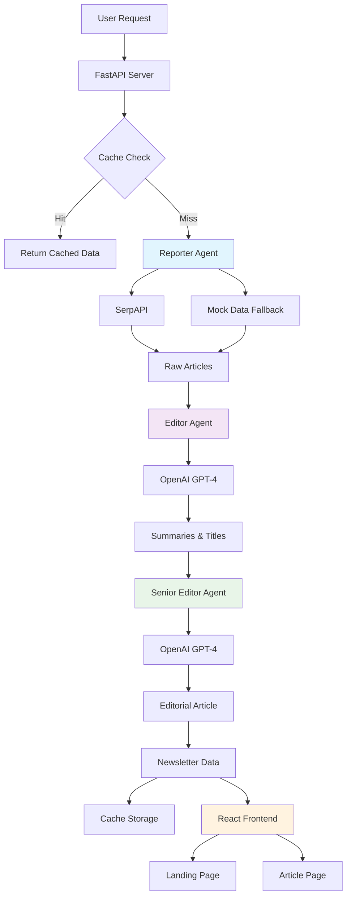
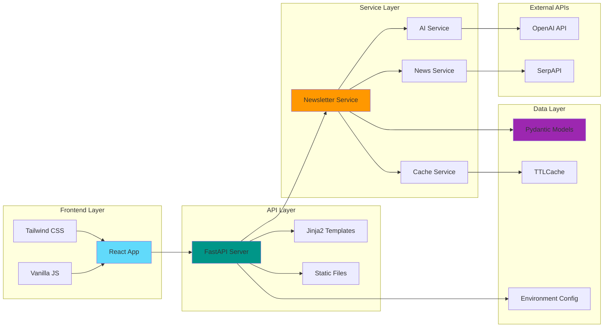
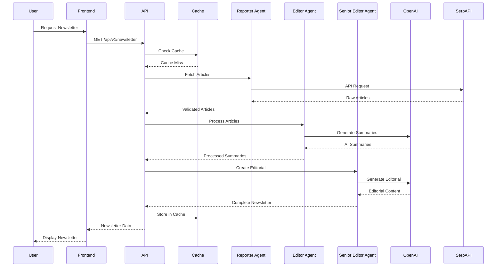
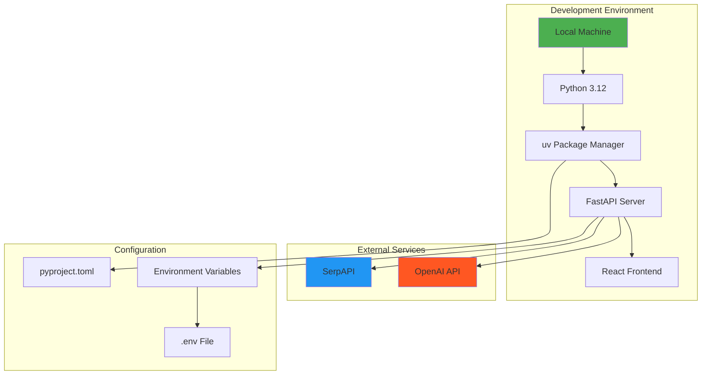

# 🏗️ System Architecture

## Multi-Agent Workflow Diagram



## Component Architecture



## Data Flow Diagram



## Deployment Architecture



## API Endpoint Structure

```mermaid
graph TD
    A[FastAPI App] --> B[Main Routes]
    A --> C[API Routes]
    A --> D[Static Files]
    A --> E[Templates]
    
    B --> F[GET /]
    B --> G[GET /article/{id}]
    B --> H[Error Handlers]
    
    C --> I[GET /api/v1/newsletter]
    C --> J[GET /api/v1/newsletter/{id}]
    C --> K[GET /api/v1/health]
    C --> L[GET /api/v1/cache/status]
    C --> M[DELETE /api/v1/cache]
    
    D --> N[CSS Files]
    D --> O[JS Files]
    D --> P[Images]
    
    E --> Q[index.html]
    E --> R[article.html]
    E --> S[404.html]
    E --> T[500.html]
    
    style A fill:#009688
    style C fill:#ff9800
    style E fill:#9c27b0
```

